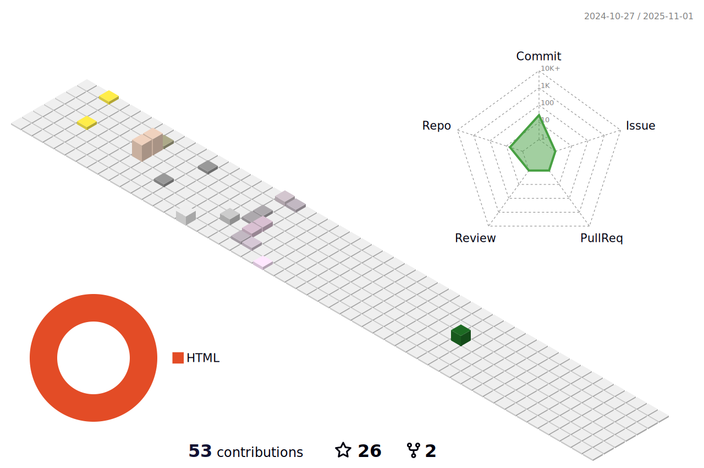

### 
I'm @joeCarf (Ao Qiao), a graduate student from Wuhan University👨‍💻, a open-source contributor🚀
  
  

- 🔭 Focusing on systems developing such as distributed system & databases  
  

- 🌱 Contributed to @Rocketmq Community, @PolardDB-X Community, @iLogtail Community
  

- ⚡ Worked as a Back-End Intern at [@Xiaohongshu(小红书)](https://www.zhihu.com/org/xiao-hong-shu-ji-zhu-tuan-dui)、 [@KuaiShou(快手)](https://github.com/kwai) and [@DataPipelineInc(数见科技)](https://github.com/DataPipelineInc). Use Java most, currently learning golang. 
  

- 🤩 Always looking forward to a software developing intern job, please contact me if you are interested.  
  

   

   

  
